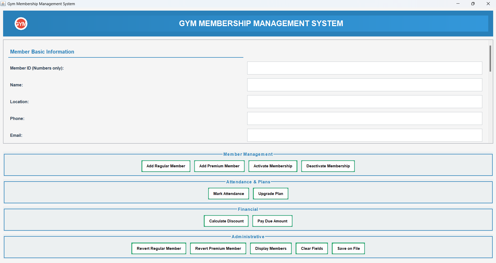

# 🏋️ Gym Membership Management System (Java GUI)

This Java application is a Gym Membership Management System with a graphical user interface (GUI) built using Java Swing. It allows gym admins to add, manage, and display information about different types of gym members — including Regular and Premium members.

---

## 📂 Project Files

- `GymGUI.java`: Main Java Swing GUI to interact with the system
- `GymMember.java`: Abstract superclass that defines common member properties
- `RegularMember.java`: Subclass representing regular members
- `PremiumMember.java`: Subclass representing premium members

---

## ⚙️ Features

- Java Swing-based GUI
- Add new gym members with different membership types
- Calculate membership fees
- Display member information in the interface
- Extensible OOP structure for future upgrades

---

## 🚀 How to Run

### Prerequisites

- Java JDK 8 or higher
- Any Java IDE (IntelliJ, Eclipse, NetBeans) or terminal

### Steps

1. Clone or download the project files
2. Open them in your Java IDE
3. Compile and run the `GymGUI.java` file

```bash
javac GymGUI.java GymMember.java RegularMember.java PremiumMember.java
java GymGUI
```


